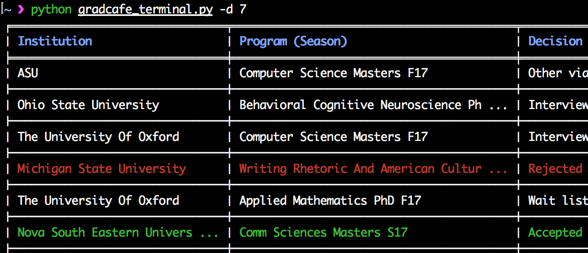
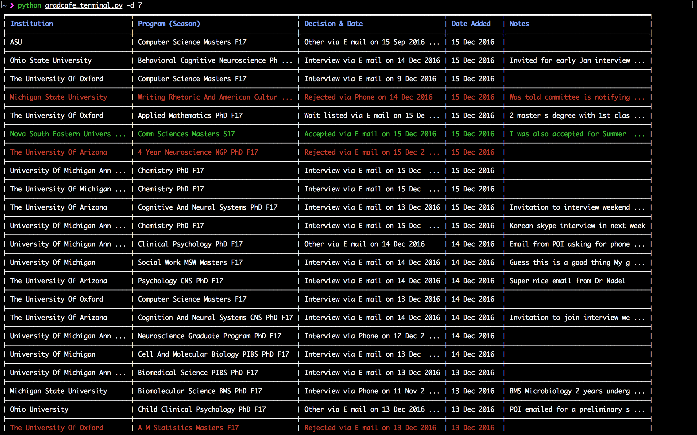

<b><a href="#usage">Usage</a></b>
|
<b><a href="#screenshots">Screenshots</a></b>

# gradcafe-terminal

See the latest results on http://thegradcafe.com for your chosen schools.  

## Usage

Modify the `UNIV_LIST` variable (line number `26`) to include the desired school names and their common variants.  

Usage: `gradcafe_terminal.py [-h] [-d DAYS]`  

The following optional command-line arguments are supported.    
`-h, --help`: Show the help message and exit.  
`-d DAYS, --days DAYS`: Maximum number of past days (from today) for which to fetch results. The default value is 7 days (1 week). Irrespective of the value chosen, a maximum of 250 results can be displayed.

## Screenshots

	

  

	

